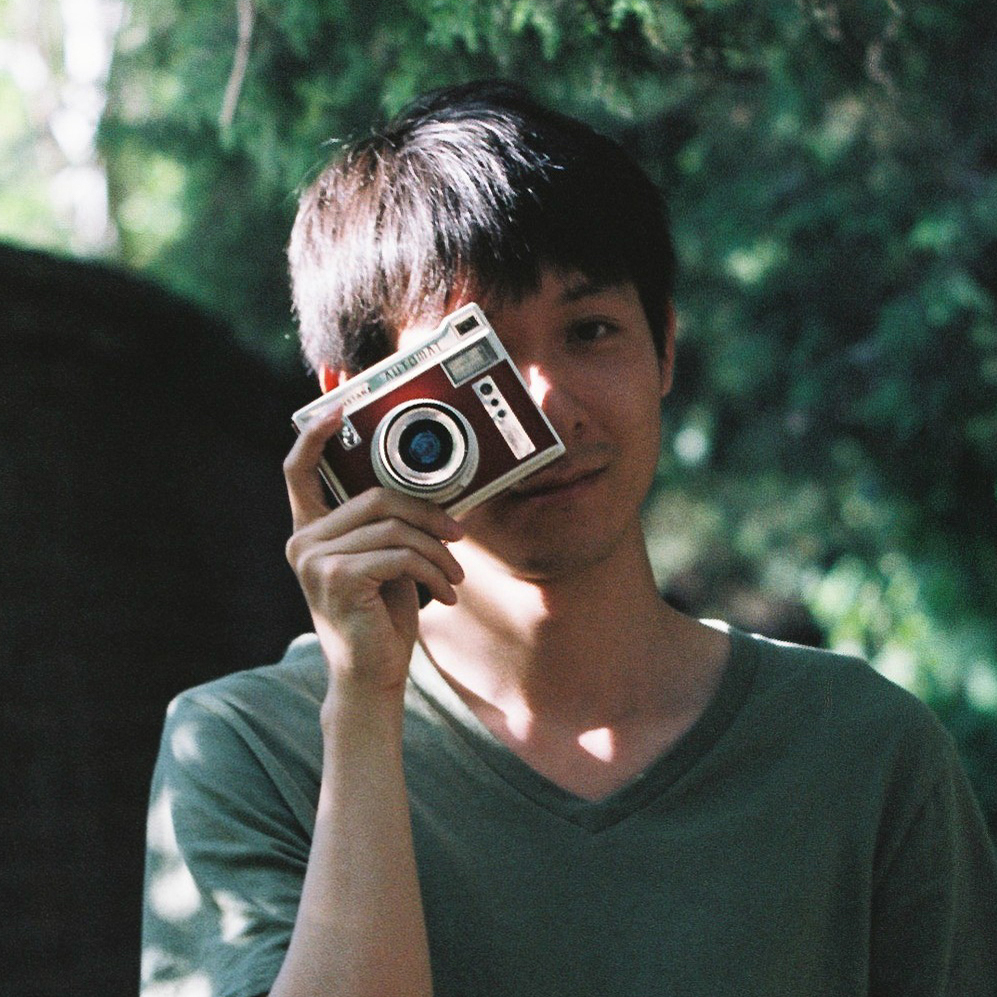

My name is Tianbai. I know very little about anything, while I’m working on physics, programming and fine arts.
I create pieces which solve the problems there. Often the problems are themselves caused by other pieces, which were also written by me.
I feel like I'm a pure oriental from bones.

I'm currently a research associate at Karlsruhe Institute of Technology, Germany.
In may daily work, I play with applied mathematics, with a special focus on fluid mechanics.
I teach courses and supervise students on kinetic theory and high-performance computing.
Before I came to Karlsruhe, I was a Ph.D. student at Peking University and a research assistant at Hong Kong University of Science and Technology.
You can find a full list of my research outcome [here](https://xiaotianbai.com/project/research).
I'm also reachable on <a href='https://scholar.google.com/citations?user=wFTQeXwAAAAJ&hl=en'>Google Scholar</a> and <a href='https://www.researchgate.net/profile/Tianbai_Xiao'>ResearchGate</a>.

Some skills that I'm interested and probably have mastered:
<ul>
    <li>Julia/Python: ★★★★★</li>
    <li>C/C++/Fortran: ★★★★</li>
    <li>MPI/OpenMP/CUDA: ★★★★</li>
    <li>Paraview/Tecplot: ★★★★</li>
    <li>Linux: ★★★★☆</li>
    <li>Ansys/Autodesk: ★★★</li>
    <li>Illustrator: ★★★★★</li>
    <li>Photoshop: ★★★★</li>
    <li>English: ★★★★★</li>
    <li>German: ★★☆</li>
</ul>

I'm an enthusiast of Debussy. Sometimes I do photography. I benefited a lot from the work of Hiroshi Sugimoto and Yoshihiko Ueda.

Write me an <a href='mailto:i@txiao.cc'>email</a> if you are interested in anything about me.

  

    
    
    
  

  <em>Gallery / <a href="https://unsplash.com/" target="_blank">Unsplash</a></em>

